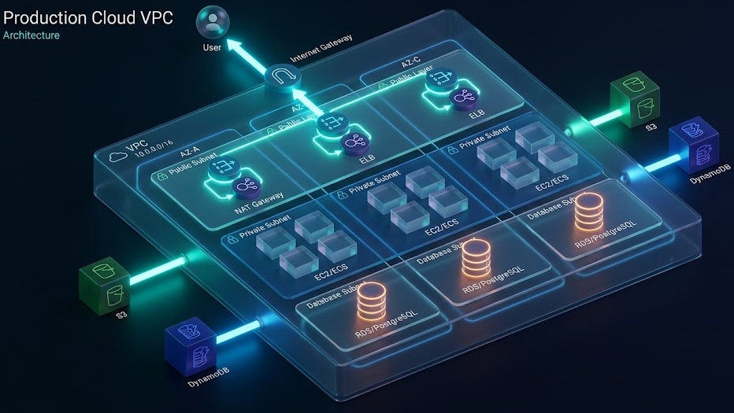
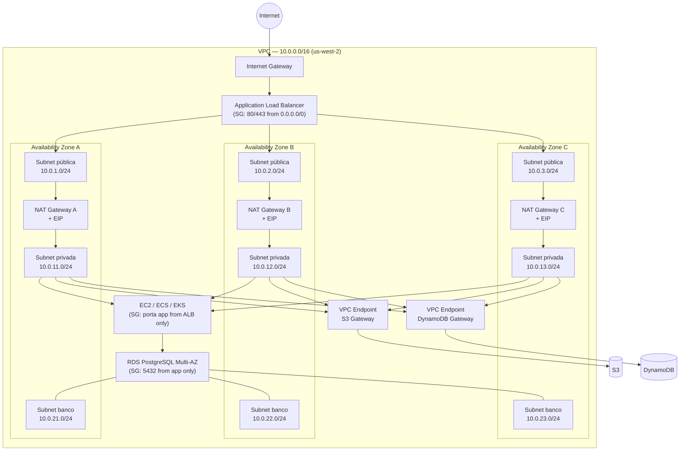
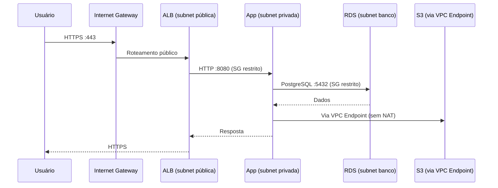

# AWS Production VPC Architecture

> Multi-AZ, VPC de nível de produção com segurança em camadas, alta disponibilidade do NAT Gateway e cobertura completa de IaC via Terraform.

[](https://www.terraform.io/)
[](https://aws.amazon.com/)
[](LICENSE)
 



---

## Índice

- [Visão geral](#visão-geral)
- [Diagrama de arquitetura](#diagrama-de-arquitetura)
- [Decisões de arquitetura](#decisões-de-arquitetura)
- [Estrutura do projeto](#estrutura-do-projeto)
- [Pré-requisitos](#pré-requisitos)
- [Como executar](#como-executar)
- [Configuração por ambiente](#configuração-por-ambiente)
- [Estimativa de custo](#estimativa-de-custo)
- [Outputs](#outputs)
- [Segurança](#segurança)
- [Próximos passos](#próximos-passos)

---

## Visão geral

Este projeto provisiona uma VPC de produção completa na AWS seguindo as boas práticas do AWS Well-Architected Framework. A arquitetura suporta cargas de trabalho multi-camada (ALB → aplicação → banco de dados) com isolamento de rede, alta disponibilidade por AZ e controle de custo por ambiente.

**O que é provisionado:**

| Recurso | Dev | Staging | Prod |
|---|---|---|---|
| VPC | `10.1.0.0/16` | `10.2.0.0/16` | `10.0.0.0/16` |
| AZs | 2 | 2 | 3 |
| Subnets públicas | 2 | 2 | 3 |
| Subnets privadas | 2 | 2 | 3 |
| Subnets de banco | 2 | 2 | 3 |
| NAT Gateway | 1 (single) | 1 (single) | 3 (por AZ) |
| VPC Endpoints (S3, DynamoDB) | sim | sim | sim |
| VPC Flow Logs | REJECT (7d) | REJECT (7d) | ALL (90d) |
| Network ACLs | sim | sim | sim |

---

## Diagrama de arquitetura



### Fluxo de tráfego



---

## Decisões de arquitetura

### 1. Três camadas de subnet (pública / privada / banco)

**Decisão:** separar banco de dados em subnets dedicadas sem rota para internet, mesmo que já estejam em subnets privadas.

**Justificativa:** defense-in-depth. Se um recurso na subnet privada for comprometido, o banco de dados ainda está isolado por uma route table diferente (sem rota de saída) e por Security Group restrito. O DB Subnet Group do RDS exige subnets em múltiplas AZs — criá-las separadas também facilita Multi-AZ failover.

**Alternativa considerada:** usar as próprias subnets privadas para o banco. Descartada porque qualquer erro de Security Group nas instâncias de aplicação poderia expor o banco a tráfego não autorizado lateral.

---

### 2. NAT Gateway por AZ em produção, único em dev/staging

**Decisão:** `single_nat_gateway = false` em prod (3 NATs), `true` em dev e staging (1 NAT).

**Justificativa:** um único NAT Gateway é um ponto único de falha. Se a AZ onde ele está cair, todas as subnets privadas das outras AZs perdem saída para internet. Em produção, isso é inaceitável. Em dev, o custo de ~US$ 32/mês por NAT adicional não justifica o HA.

**Custo da decisão:** +US$ 64/mês em prod (2 NATs extras) vs. +US$ 0 em dev/staging.

---

### 3. VPC Endpoints Gateway para S3 e DynamoDB

**Decisão:** criar endpoints Gateway para S3 e DynamoDB em todos os ambientes.

**Justificativa:** endpoints Gateway são gratuitos e eliminam o tráfego de S3/DynamoDB passando pelo NAT Gateway (que cobra por GB transferido). Em cargas com alto volume de objetos S3 ou operações DynamoDB, a economia é significativa. Adicionalmente, o tráfego não sai da rede AWS — melhora latência e segurança.

**Impacto:** rota automática adicionada nas route tables privadas e públicas. Nenhuma alteração necessária na aplicação.

---

### 4. Network ACLs como segunda camada de controle

**Decisão:** NACLs nas subnets públicas e privadas, além dos Security Groups.

**Justificativa:** Security Groups são stateful e operam no nível da instância. NACLs são stateless e operam no nível da subnet — permitem bloquear tráfego antes que ele chegue às instâncias. A combinação das duas camadas segue o princípio de defense-in-depth e é exigência em ambientes com compliance (PCI-DSS, SOC 2).

**Tradeoff:** NACLs stateless exigem regras de saída para portas efêmeras (1024–65535) para respostas funcionarem. Isso aumenta a superfície de regras, mas é compensado pelo ganho em segurança de perímetro.

---

### 5. Tags obrigatórias em todos os recursos

**Decisão:** `gerenciado-por`, `projeto`, `ambiente` aplicados via `default_tags` no provider.

**Justificativa:** sem tags consistentes, o Cost Explorer não consegue separar custos por projeto ou ambiente. Tags aplicadas no provider garantem cobertura mesmo para recursos criados por módulos que esquecem de declará-las.

---

### 6. CIDR blocks planejados para crescimento

**Decisão:** `/16` para cada ambiente com subnets `/24`.

| Ambiente | VPC CIDR | IPs disponíveis por subnet |
|---|---|---|
| prod | `10.0.0.0/16` | 251 por `/24` |
| dev | `10.1.0.0/16` | 251 por `/24` |
| staging | `10.2.0.0/16` | 251 por `/24` |

**Justificativa:** CIDRs separados por ambiente permitem peering futuro entre VPCs sem conflito. Subnets `/24` oferecem 251 endereços utilizáveis — suficiente para EKS (projeto 07) que consome um IP por pod.

---

## Estrutura do projeto

```
terraform/
├── modules/
│   ├── vpc/                    # VPC, subnets, IGW, NAT, route tables, NACLs, endpoints
│   │   ├── main.tf
│   │   ├── variables.tf
│   │   └── outputs.tf
│   ├── security-groups/        # SGs para ALB, app, banco e bastion
│   │   ├── main.tf
│   │   ├── variables.tf
│   │   └── outputs.tf
│   └── flow-logs/              # VPC Flow Logs → CloudWatch
│       ├── main.tf
│       ├── variables.tf
│       └── outputs.tf
└── environments/
    ├── dev/                    # single NAT, 2 AZs, REJECT logs, 7 dias
    │   ├── main.tf
    │   ├── variables.tf
    │   └── outputs.tf
    ├── staging/                # single NAT, 2 AZs
    │   ├── main.tf
    │   ├── variables.tf
    │   └── outputs.tf
    └── prod/                   # NAT por AZ, 3 AZs, ALL logs, 90 dias
        ├── main.tf
        ├── variables.tf
        └── outputs.tf
```

---

## Pré-requisitos

```bash
# Versões necessárias
terraform --version   # >= 1.5
aws --version         # >= 2.x

# Autenticação AWS (conta de lab pessoal)
aws configure
# AWS Access Key ID: ...
# AWS Secret Access Key: ...
# Default region name: us-west-2
# Default output format: json

# Verificar identidade antes de aplicar
aws sts get-caller-identity
```

### Bootstrap do remote state (executar uma vez)

```bash
# Criar bucket S3 e tabela DynamoDB para armazenar o state
ACCOUNT_ID=$(aws sts get-caller-identity --query Account --output text)
BUCKET="terraform-state-${ACCOUNT_ID}-us-west-2"

aws s3api create-bucket \
  --bucket "$BUCKET" \
  --region us-west-2 \
  --create-bucket-configuration LocationConstraint=us-west-2

aws s3api put-bucket-versioning \
  --bucket "$BUCKET" \
  --versioning-configuration Status=Enabled

aws s3api put-bucket-encryption \
  --bucket "$BUCKET" \
  --server-side-encryption-configuration \
  '{"Rules":[{"ApplyServerSideEncryptionByDefault":{"SSEAlgorithm":"AES256"}}]}'

aws dynamodb create-table \
  --table-name terraform-state-lock \
  --attribute-definitions AttributeName=LockID,AttributeType=S \
  --key-schema AttributeName=LockID,KeyType=HASH \
  --billing-mode PAY_PER_REQUEST \
  --region us-west-2

echo "Bucket: $BUCKET"
# Substitua SEU-BUCKET-TERRAFORM-STATE pelo valor acima nos main.tf
```

---

## Como executar

### Dev (recomendado para primeiros testes)

```bash
cd terraform/environments/dev

# Inicializar — baixa providers e conecta ao backend S3
terraform init

# Revisar o plano antes de aplicar
terraform plan -out=tfplan

# Aplicar (cria ~25 recursos, leva ~3 min)
terraform apply tfplan

# Verificar outputs
terraform output

# ⚠️ DESTRUIR após uso para evitar custo
terraform destroy
```

### Prod

```bash
cd terraform/environments/prod

terraform init
terraform plan -out=tfplan

# Prod tem 3 NATs — leva ~5 min e custa ~US$0.10/h quando ligado
terraform apply tfplan

terraform destroy
```

### Validações locais (sem AWS)

```bash
# Formatar código
terraform fmt -recursive ../../

# Validar sintaxe
terraform validate

# Scan de segurança estático (instalar: pip install checkov)
checkov -d . --framework terraform
```

---

## Configuração por ambiente

### Diferenças chave

| Variável | Dev | Staging | Prod |
|---|---|---|---|
| `single_nat_gateway` | `true` | `true` | `false` |
| AZs | 2 | 2 | 3 |
| Flow logs `traffic_type` | `REJECT` | `REJECT` | `ALL` |
| Flow logs retenção | 7 dias | 7 dias | 90 dias |
| VPC CIDR | `10.1.0.0/16` | `10.2.0.0/16` | `10.0.0.0/16` |

### Customizar variáveis

```hcl
# terraform/environments/dev/variables.tf
variable "bastion_allowed_cidrs" {
  default = ["SEU_IP/32"]   # substitua pelo seu IP: curl ifconfig.me
}
```

---

## Estimativa de custo

> Valores em USD, região us-west-2, calculados com AWS Pricing Calculator.
> Preços sujeitos a alteração — verificar em [aws.amazon.com/pricing](https://aws.amazon.com/pricing).

### Dev (estudo — destruir após uso)

| Recurso | Qtd | Preço unit./h | Custo/mês (24h) |
|---|---|---|---|
| NAT Gateway (horas) | 1 | US$ 0.045 | US$ 32.40 |
| NAT Gateway (dados) | ~10 GB | US$ 0.045/GB | US$ 0.45 |
| VPC Flow Logs (CloudWatch) | ~1 GB | US$ 0.50/GB | US$ 0.50 |
| EIP (enquanto ligado) | 1 | US$ 0.005/h | US$ 3.60 |
| **Total estimado** | | | **~US$ 37/mês** |

> Se destruir após cada sessão (8h/dia, 20 dias/mês): **~US$ 10/mês**.

### Prod (simulação — não deixar ligado em lab)

| Recurso | Qtd | Preço unit./h | Custo/mês |
|---|---|---|---|
| NAT Gateway (horas) | 3 | US$ 0.045 | US$ 97.20 |
| NAT Gateway (dados) | ~50 GB | US$ 0.045/GB | US$ 2.25 |
| VPC Flow Logs (ALL) | ~10 GB | US$ 0.50/GB | US$ 5.00 |
| EIPs | 3 | US$ 0.005/h | US$ 10.80 |
| **Total estimado** | | | **~US$ 115/mês** |

### Economia dos VPC Endpoints

Sem endpoints, 50 GB/mês de tráfego S3 via NAT custaria US$ 2.25/mês adicional.
Com endpoints Gateway (gratuitos), esse custo é zero — break-even imediato.

### Controle de custo

```bash
# Ver gasto do projeto no mês atual
aws ce get-cost-and-usage \
  --time-period Start=$(date +%Y-%m-01),End=$(date +%Y-%m-%d) \
  --granularity MONTHLY \
  --filter '{"Tags":{"Key":"projeto","Values":["cal"]}}' \
  --metrics BlendedCost \
  --query 'ResultsByTime[].Total.BlendedCost'
```

---

## Outputs

Após `terraform apply`, os seguintes valores ficam disponíveis para outros módulos:

```bash
terraform output vpc_id               # vpc-xxxxxxxxxxxxxxxxx
terraform output public_subnet_ids    # ["subnet-xxx", "subnet-yyy", "subnet-zzz"]
terraform output private_subnet_ids   # ["subnet-aaa", "subnet-bbb", "subnet-ccc"]
terraform output database_subnet_ids  # ["subnet-ddd", "subnet-eee", "subnet-fff"]
terraform output nat_public_ips       # ["x.x.x.x", "y.y.y.y", "z.z.z.z"]
terraform output db_subnet_group_name # cal-prod-db-subnet-group
terraform output alb_sg_id            # sg-xxxxxxxxxxxxxxxxx
terraform output app_sg_id            # sg-yyyyyyyyyyyyyyyyy
terraform output database_sg_id       # sg-zzzzzzzzzzzzzzzzz
```

Esses outputs são consumidos diretamente pelos projetos 03 (Auto-Scaling Platform) e 07 (EKS Cluster).

---

## Segurança

### Modelo de segurança em camadas

```
Internet
    │
    ▼
[NACL público] ← permite 80, 443, portas efêmeras
    │
    ▼
[Security Group ALB] ← permite 80, 443 de 0.0.0.0/0
    │
    ▼
[NACL privado] ← permite tráfego interno VPC + portas efêmeras
    │
    ▼
[Security Group App] ← permite porta app APENAS do SG do ALB
    │
    ▼
[Security Group Banco] ← permite 5432 APENAS do SG da app
    │
    ▼
[Subnet banco sem route para internet]
```

### Checklist de segurança

- [x] Subnets de banco sem rota de saída para internet
- [x] Security Groups com princípio de menor privilégio
- [x] Security Groups referenciados por ID (não por CIDR) entre camadas
- [x] VPC Flow Logs habilitados em prod (modo ALL)
- [x] S3 e DynamoDB acessados via VPC Endpoint (sem passar pela internet)
- [x] NACLs como segunda camada de controle de tráfego
- [x] Sem credenciais hardcoded — autenticação via AWS CLI / IAM roles
- [x] Remote state com criptografia AES-256 e versionamento habilitado
- [ ] AWS Config Rules para monitorar desvios (próximo projeto)
- [ ] GuardDuty habilitado (projeto 14 — Security Pipeline)

---


## Referências

- [AWS VPC Best Practices](https://docs.aws.amazon.com/vpc/latest/userguide/vpc-security-best-practices.html)
- [AWS Well-Architected — Security Pillar](https://docs.aws.amazon.com/wellarchitected/latest/security-pillar/welcome.html)
- [Terraform AWS VPC Module](https://registry.terraform.io/modules/terraform-aws-modules/vpc/aws/latest)
- [AWS NAT Gateway pricing](https://aws.amazon.com/vpc/pricing/)
- [VPC Endpoints — Gateway type](https://docs.aws.amazon.com/vpc/latest/privatelink/gateway-endpoints.html)

---
